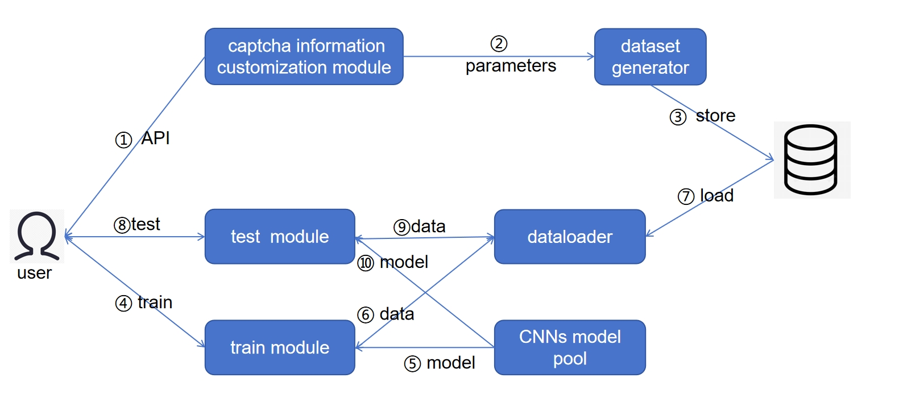
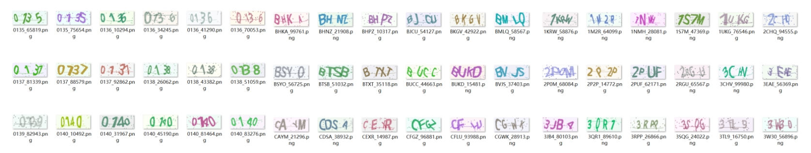
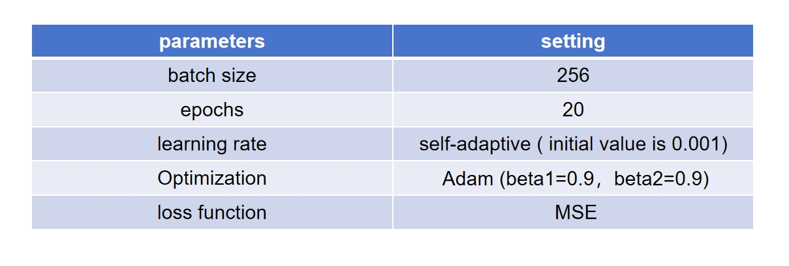

# A CNN training framework for captcha recognition

## introduction
This framework is designed for deep learning beginners, can be used to experience the training process of neural networks, experience tuning optimization, is very easy to deploy, and can run on your personal computer in a short time.

## overview

## dataset

## test

The pure numeric CAPTCHA, pure uppercase letter CAPTCHA and alphanuloid mixed CAPTCHA are tested, and resnet50 in the model pool is used for testing, and the accuracy is 99.7%,,

## some tips
- Supports cpu/gpu
- pytorch framework
- easy deploy on PC

## how to run
- git clone or download zip.
- Install the required packages.
- modify parameters for your model or add model.
- Train and test the model.

## attention
- Console interaction, you can choose diyCNN,ResNet etc.
- The dataset has high complexity and contains noise, curve and other interference information.
- The project is not yet complete and there are multiple directions for optimization.
